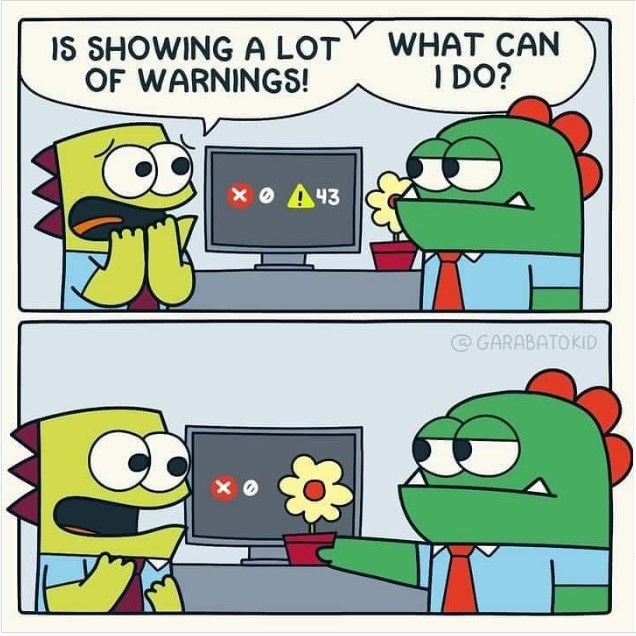

# **JavaScript being 'strict' 😬**

[Home](../README.md) / JavaScript being 'strict' 😬

JavaScript has a lot on inconsistencies which can be managed by using the `'strict mode'`. TypeScript uses this by default. It was introduced in ECMAScript 5, is a way to opt in to a restricted variant of JavaScript, thereby implicitly opting-out of the default `"sloppy mode"`.

> The default, non-strict mode referred to as "sloppy mode". This isn't an official term, but used conventionally.

```md
Strict mode makes several changes to normal JavaScript semantics:

➡ Eliminates some JavaScript silent errors by changing them to throw errors.

➡ Fixes mistakes that make it difficult for JavaScript engines to perform optimizations: strict mode code can sometimes be made to run faster than identical code that's not strict mode.

➡ Prohibits some syntax likely to be defined in future versions of ECMAScript.
```

Here is how you would invoke the strict mode:

```js
"use strict"; // That's it! 😛

message = "Its gonna be 'strict' now! 😬"; // throws an error, Since 'message' not declared
```

## **Should you use 'strict' mode** 🤔

To maintain your sanity you should.

[MDN](https://developer.mozilla.org/en-US/docs/Web/JavaScript/Reference/Strict_mode) explains:

```md
Strict mode makes several changes to normal JavaScript semantics. First, strict mode eliminates some JavaScript silent errors by changing them to throw errors.
```

This is highly desirable. I know that sounds counterintuitive. Why would you want more errors in your code?

Here’s the thing: there were already errors in your code. The browser just wasn’t telling you about them, so they might crop up in unexpected ways that are harder to find.

Turning on strict mode helps you find errors sooner, before they become bigger problems. And it forces you to write better code.

> 

Read more [here](https://developer.mozilla.org/en-US/docs/Web/JavaScript/Reference/Strict_mode) and [here](https://www.w3schools.com/js/js_strict.asp).

---

See Also:

> ⚫ Event Loop. 🔁 😵 [ Read ▶ ](./event-loop.md)  
> ⚫ What is the Truth? 🤥 [ Read ▶ ](./what-is-the-truth.md)  
> ⚫ Hoisting 🏴‍☠️ ? ...is this a Ship? 🤨 [ Read ▶ ](./hoisting.md)
